# Consultas SQL - Taller

## Modelo físico de la BD
**Implementado en phpMyAdmin**

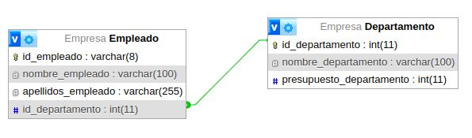

## Tabla Departamento
**Poblada con los datos indicados, en phpMyAdmin**

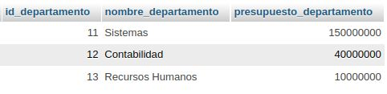

## Estructura Empleado
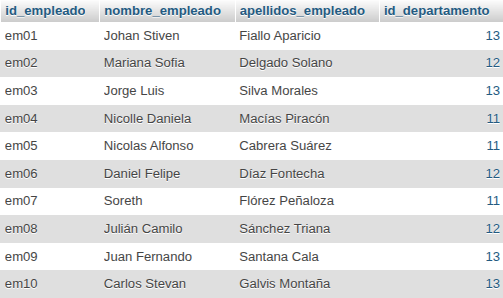

# Consultas SQL

1. Obtener la lista de los apellidos de todos los empleados.

` SELECT apellidos_empleado AS Apellidos FROM Empleado;
 `

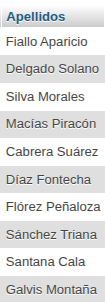

2. Obtener los apellidos de todos los empleados sin repeticiones.

` SELECT DISTINCT apellidos_empleado FROM Empleado;
 `

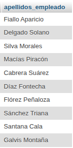

3. Obtener todos los datos de los empleados que se apellidan 'Gomez'.

` SELECT apellidos_empleado AS Apellidos FROM Empleado WHERE apellidos_empleado = 'Gomez'; `

4. Obtener todos los datos de los empleados que se apellidan "Diaz" y los que se apellidan "Rodriguez".  Usar OR o IN

` SELECT apellidos_empleado AS Apellidos FROM Empleado WHERE apellidos_empleado LIKE 'Diaz%' OR apellidos_empleado LIKE 'Rodriguez%'; `

5. Obtener los nombres de los empleados que trabajan en el departamento 11

` SELECT nombre_empleado AS Empleado FROM Empleado WHERE id_departamento = 11; ` 

6. Obtener todos los datos de los empleados cuyo apellido empiece por 'P'

` SELECT apellidos_empleado AS Apellido FROM Empleado WHERE apellidos_empleado LIKE 'P%'; `

7. Obtener el presupuesto total de todos los departamentos.

` SELECT SUM(presupuesto_departamento) AS Presupuesto_Total FROM Departamento; `

8. Obtener el número de empleados de cada departamento.

` SELECT id_departamento, COUNT(*) AS Numero_Empleados FROM Empleado GROUP BY id_departamento; `

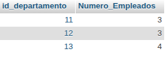

9. Obtener un listado completo de empleados, incluyendo por cada empleado los datos del empleado y de su departamento.

` SELECT e.*, d.* FROM Empleado e INNER JOIN Departamento d ON e.id_departamento = d.id_departamento; `

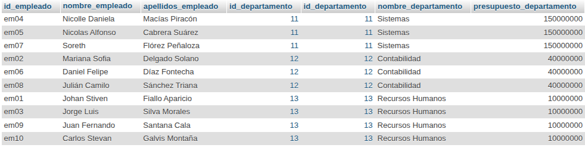

10. Obtener un listado completo de empleados, incluyendo el nombre y apellidos del empleado junto al nombre y presupuesto de su departamento.

` SELECT e.nombre_empleado, e.apellidos_empleado, d.nombre_departamento, d.presupuesto_departamento FROM Empleado e INNER JOIN Departamento d ON e.id_departamento = d.id_departamento; `

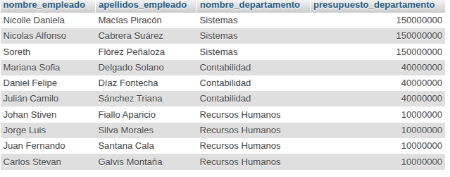

11. Obtener los nombres y apellidos de los empleados que trabajen en departamentos cuyo presupuesto sea mayor a 100000000

` SELECT e.nombre_empleado, e.apellidos_empleado FROM Empleado e INNER JOIN Departamento d ON e.id_departamento = d.id_departamento WHERE d.presupuesto_departamento > 100000000; `

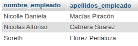

# Cláusula Inner Join

Imagina que el INNER JOIN es como un organizador de eventos que solo deja pasar a las personas que tienen una invitación válida para una mesa específica. En nuestro ejemplo:

Tenemos la Tabla Departamento (con su ID, nombre y presupuesto).

Tenemos la Tabla Empleado (con su ID, nombre, apellido y el ID del departamento al que pertenece).

¿Qué hace el INNER JOIN?

Busca coincidencias exactas entre la columna id_departamento de ambas tablas. Es como armar un rompecabezas:

Ana (Dept 1) coincide con el departamento de Ventas. ¡Se unen en el resultado!

Juan (Dept 1) también coincide con Ventas. ¡Se unen!

Pedro (Dept 2) coincide con Marketing. ¡Se unen!

Luisa (Dept 4): Aquí está el truco. Como no existe un departamento con ID 4 en la tabla Departamento, Luisa no aparece en el resultado final. El INNER JOIN es estricto y solo muestra lo que coincide perfectamente en ambos lados.

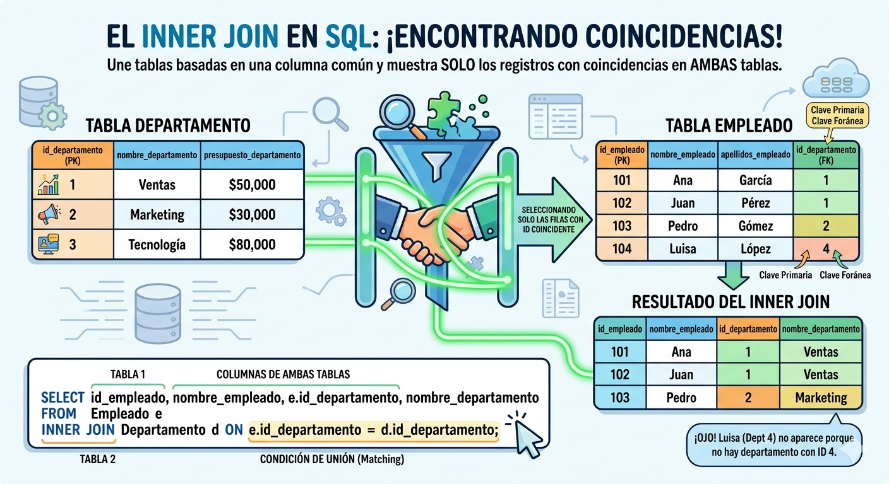

# Sub Consultas
Las dos tablas de entrada: En el lado izquierdo, mostramos las tablas Departamento (con presupuestos) y Empleado. Ambas tienen datos de ejemplo que los estudiantes pueden relacionar fácilmente.

El PROCESO visual: Un gran diagrama de flujo central divide el concepto en dos pasos claros:

PASO 1 (SUBCONSULTA): Ejecuta una consulta interna para obtener una lista de id_departamento de aquellos departamentos con un presupuesto mayor a 100,000. El resultado es una lista limpia: (20, 30).

PASO 2 (CONSULTA PRINCIPAL): La consulta externa utiliza este resultado para filtrar la tabla Empleado. En lugar de buscar IDs de forma manual, dice: "Dame a los empleados cuyo id_departamento esté IN (dentro) de esa lista de grandes presupuestos."

El RESULTADO FINAL: Una tabla limpia que muestra solo los nombres y apellidos de los empleados que cumplen la condición: Luis, Marta y Juan.

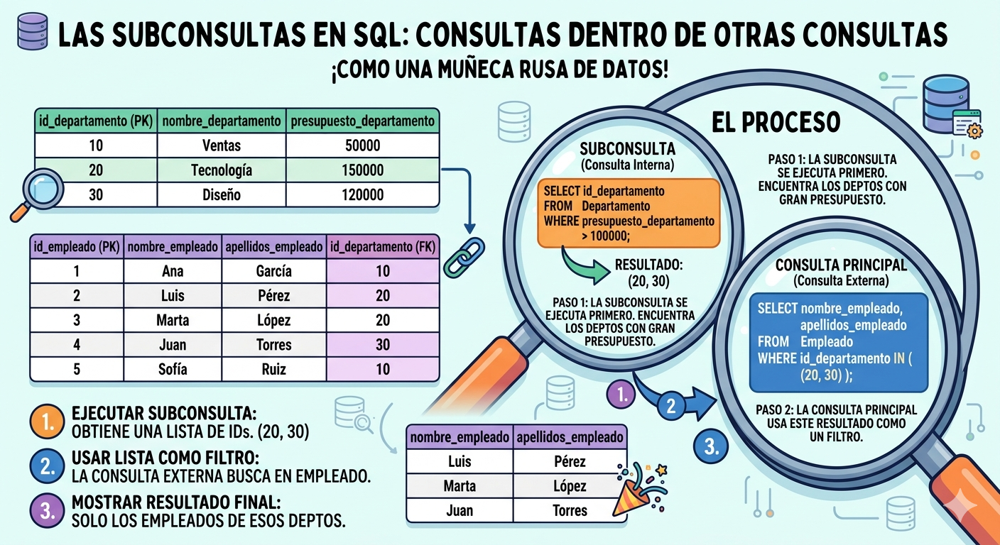